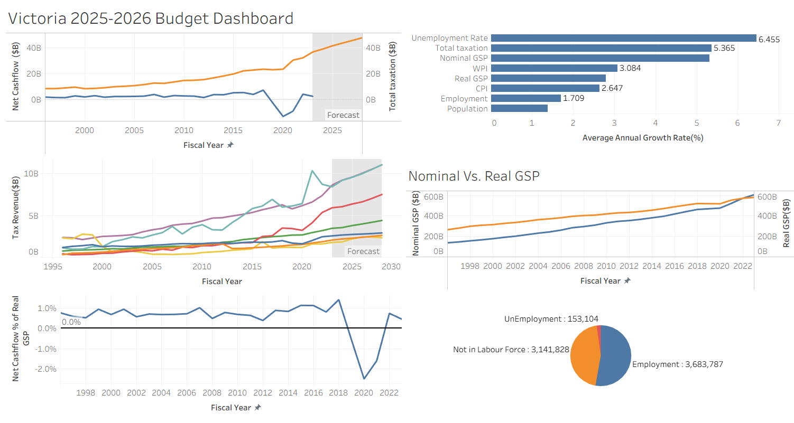

# Victoria Budget 2025‑2026 Analysis

> A visual deep‑dive into Victoria’s State Budget—tracking revenue streams, economic drivers, and cashflow health to inform strategic planning.

> Note : This project was mostly a "fun" self project I did. So, I haven't thought much of a practical value for this.

---

## Overview

This project transforms economic data into an interactive dashboard. By charting historical trends and forecasts for Victoria’s 2025–26 fiscal plan, it helps to:

- **Understand revenue mix** and pressure points across tax categories  
- **Benchmark economic performance** through key macro indicators  
- **Assess fiscal sustainability** via net cashflow and surplus/deficit ratios  
- **Inform strategic decisions** for businesses and policy analysts

## Data Sources

All tables are CC BY 4.0 licensed:

1. **State Taxation Revenue**  
   <https://discover.data.vic.gov.au/dataset/state-budget-2025-26-state-taxation-revenue>  
2. **Macroeconomic Indicators**  
   <https://discover.data.vic.gov.au/dataset/state-budget-2025-26-macroeconomic-indicators>  
3. **Cash‑Flow Statement**  
   <https://discover.data.vic.gov.au/dataset/state-budget-2025-26-cash-flow-statement-aggregates>  
4. **License**  
   <https://creativecommons.org/licenses/by/4.0>  

## Methodology & Tools

- **Data Cleaning**:  
  • Used Excel to standardize column names, parse dates, fill missing values.  
- **Visualization & Dashboard**:  
  • Built in **Tableau Public** for interactivity, filters, and annotations.

## Dashboard Link

[View the dashboard on Tableau Public](https://public.tableau.com/app/profile/samarth.gohel/viz/Victoria2025-2026BudgetDashboard/Victoria2025-2026BudgetDashboard?publish=yes)

## Charts & Insights

### 1. **Tax Revenue by Brackets**  
  
Shows historical and forecasted revenue (1995–2030) for key categories: payroll tax, stamp duties, land tax, mining royalties, etc.  
- **Observation:** Payroll tax (teal) accelerates after 2015, overtaking stamp duties (purple) by 2022.  
- **Forecast:** Steady growth across all streams, with payroll and stamp duties driving 70 % of total revenue by 2028.

### 2. **Average Annual Growth Rate: Key Macro Indicators**  
  
Ranked bar chart of compound annual growth (2018–2026) for unemployment, taxation, GSP, WPI, CPI, employment, and population.  
- **Observation:** Unemployment rate shows the fastest average change (6.45 %), reflecting extreme swings during the pandemic.  
- **Taxation & GDP:** Total tax receipts (5.37 %) and nominal GSP (4.99 %) outpace inflation (CPI 2.65 %), indicating real revenue growth.

### 3. **Budget Surplus/Deficit Relative to Economy**  
  
Line chart of net cashflow as a % of real GSP (1996–2022).  
- **Observation:** Stable surplus of ~0.5–1.0 % pre‑COVID; sharp deficit of –2.5 % in 2020, rebounding to +0.7 % by 2022.  
- **Implication:** Pandemic relief drove a one‑off deficit but fiscal balance is projected to restore within two years.

### 4. **Nominal Vs. Real GSP**  
  
Dual‑axis trends for Victoria’s gross state product in nominal and real terms.  
- **Observation:** Nominal GSP (orange) steadily rises from $270 B to $600 B; real GSP (blue) lags pre‑2021 but converges post‑2021.  
- **Insight:** Inflation-adjusted growth confirms underlying economic expansion, not just price effects.

### 5. **Net Cashflow vs. Total Taxation**  
  
Overlay of net cashflow ($B) and total tax revenue ($B) with forecast shading.  
- **Observation:** Taxation (orange) climbs from $8 B to $50 B by 2028; cashflow (blue) fluctuates around $3–5 B, dipping into -$13 B in 2020.  
- **Takeaway:** Robust revenue growth cushions episodic cashflow shocks.

### 6. **Employment Composition**  
  
Current workforce breakdown: employed vs. unemployed vs. not in labour force.  
- **Numbers:** 3.68 M employed, 153 K unemployed, 3.14 M out of labour force.  
- **Context:** 4.0 % unemployment aligns with national benchmarks and supports revenue forecasts tied to payroll taxes.